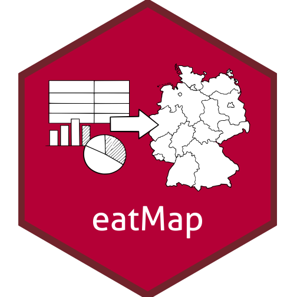
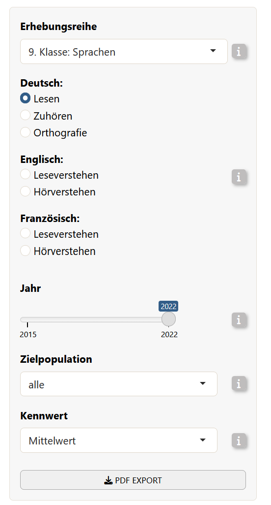
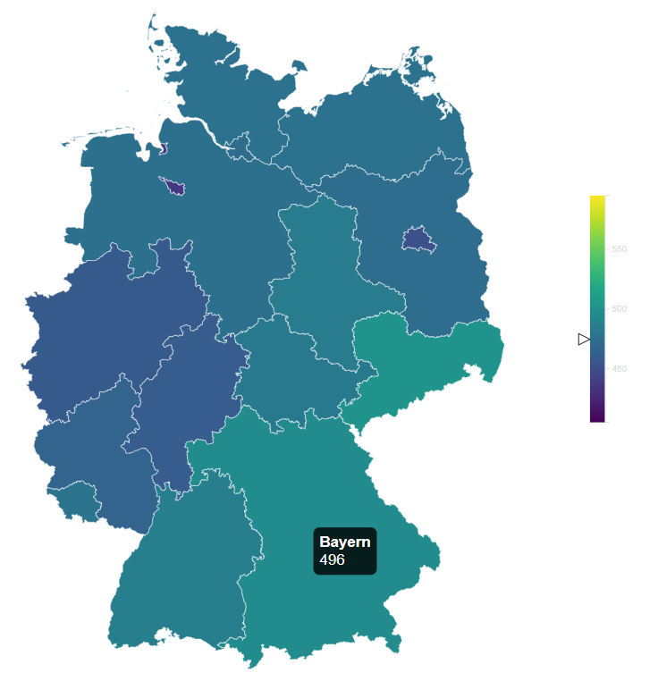

# eatMap 

<!-- badges: start -->

[](https://github.com/franikowsp/eatMap/actions/workflows/R-CMD-check.yaml)
<!-- badges: end -->

`eatMap` is a helper package that transforms the input data frame from
the [BT-ShinyApp](https://github.com/iqb-research/BT-ShinyApp) into an
interactive widget using JavaScript. It is a small R wrapper around a
JavaScript/htmlwidgets map of Germany for displaying IQB Bildungstrend
results inside a Shiny application.

## Installation

You can install the development version of `eatMap` from
[GitHub](https://github.com/iqb-research/eatMap) with:

``` r
# install.packages("devtools")
devtools::install_github("iqb-research/eatMap")
```

## Usage

``` r
library(eatMap)
```

Required by `eatMap()`:

- `data`: prepared result data selected by the user of BTShinyApp.
- `config`: a nested R list provided by the BTShinyApp that contains
  information on which subject areas and competencies exist and how the
  variables in the data object should be labeled, grouped, colored, and
  shown.
- `lang`: “de” or “en”.

Returned by `eatMap()`:

- an `htmlwidget` that can be embedded in Shiny via `renderEatMap()` and
  `eatMapOutput()`

## Example: Testing the Map locally

`eatMap` is designed to be used together with `BTShinyApp`. During
development, changes to the JavaScript map code can be tested with
example data from `BTShinyApp`.

``` r
library(BTShinyApp)

BTdata <- readRDS(
  system.file("extdata", "BTdata_processed.Rds", package = "BTShinyApp")
)

load(
  system.file("extdata", "ui_variables.rda", package = "BTShinyApp")
)
```

The object `BTdata` contains the processed Bildungstrend data. The file
`ui_variables.rda` provides additional UI/configuration objects,
including the `config` object used by `eatMap()`.

Next, we simulate a data selection that usually happens in the
BTShinyAPP user interface.

This selects one concrete subset of the Bildungstrend data: German
reading results for grade 9, cycle `"9. Klasse: Sprachen"`, parameter
`"mean"`, year `2022`, and target population `"alle"`…

<table>
<tr>
<td width="50%" valign="top">

<strong>Code</strong>

<pre><code class="language-r">map_data <- BTdata$de
&#10;map_data <- map_data[map_data$cycle == "9. Klasse: Sprachen" &
               map_data$parameter == "mean" &
               map_data$year == 2022 &
               map_data$fachKb == "Deutsch-Lesen" &
               map_data$targetPop == "alle",]
  &#10;)</code></pre>
</td>
<td width="50%" valign="top">

<strong>Which corresponds to…</strong>



</td>
</tr>
</table>

Then, you can render the map locally:

``` r
eatMap(
  data = map_data,
  config = config$de,
  lang = "de"
)
```



## The flow inside BTShinyApp

Within BTShinyApp, `eatMap` is used as the interactive map output. In
the server, the Shiny app handles user input, filters the processed
Bildungstrend data, and passes the selected data subset together with
the language-specific configuration object to `eatMap`:

``` r
output$deutschlandkarte <- eatMap::renderEatMap({ # save the map into output so it can be accessed by the UI
  
  eatMap::eatMap(
      data = data_selected(), # The data of the selected configuration by the user
      config = config[[lang()]], # The config object with the chosen language
      lang = lang() # which language was chosen
    )
  
})
```

Then, in the UI, the map is placed with:

``` r
eatMapOutput("deutschlandkarte", width = "100%", height = "auto")
```

## Making changes in eatMap

When making changes to the map, the typical workflow is:

1.  Load processed example data from `BTShinyApp`.
2.  Select one realistic result subset (see example above).
3.  Make changes in the JavaScript source files. JavaScript changes
    should be made in `srcjs/modules`.
4.  Bundle the JavaScript code into the htmlwidget (see below).
5.  Test the map locally with `eatMap()`.

After changing the JavaScript source files, bundle the widget again:

``` r
# Install the following dependencies if needed:
install.packages("packer")
packer::npm_install()

# Call:
devtools::document()

# Reload the package:
devtools::load_all()

# Bundle JavaScript changes into inst/htmlwidgets:
packer::bundle()
```

The command `packer::bundle()` writes the bundled JavaScript files to
`inst/htmlwidgets`. These bundled files are the files used by the R
htmlwidget.
